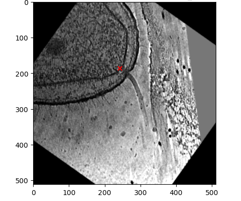
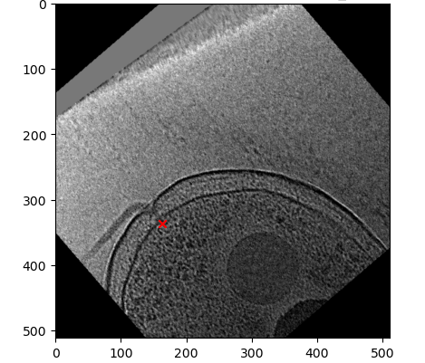

# Bacterial Flagellar Motor Detection
In this object detection work we aim to locate bacterial flagellar motors from 2D cryogenic electromagnetic images leveraging a RCNN with a ResNet50 backbone in pytorch.

## Table of Contents
- [Files](#files)
- [Data](#data)
- [Methods](#methods)
- [Results](#results)
- [Authors](#authors)

## Files
- `__pycache__/`: Cache directory
- `readme_images/`: Folder containing images for README
- `README.md`: Main project README file
- `image_name_to_coordinates.json`: JSON file containing image names and image coordinates
- `model_train_data_transformations.ipynb`: Jupyter Notebook for model training data transformations
- `preprocessing.ipynb`: Jupyter Notebook for preprocessing data
- `train.csv`: CSV file containing training data
- `train.ipynb`: Jupyter Notebook for model training
- `utils.py`: Python utility functions

## Data
The data contains 3960 2D cryogenic electromagnetic images of bacteria, some with flagellar motors and some without. The data is split it a train and test set. The labels can be found in the `train.csv` file. The labels are structured as x and y coordinates of the image where the motors are found.

### Sample Images from the Training Set with Motors Labeled

## Methods
To complete this task we use a RCNN with a ResNet50 backbone based on the IMAGENET1k dataset and fine-tune it to the data. We also leverage multiple data transformations to artificially increase the training set size with the hopes of making the model more externally valid. The first data transformation that we used were randomly changing the brightness since many images were darker or brighter than others. The second was randomly flipping the image vertically and horizontally. The final transformation we used was a random rotation since we always have an view orthogonal to the image. 

### Example 1: Training Image After Transformations (Motor Indicated with Red 'x')

### Example 2: Training Image After Transformations (Motor Indicated with Red 'x')

## Results
In fine-tuning the pre-trained model were were able to drastically decrease the loss on the training set. The results from the validation set were appoximately 0.44.

### Training Loss

## Authors

Noah Andersen https://github.com/noah-andersen

Hunter Davis  https://github.com/kingarthurdavis78

